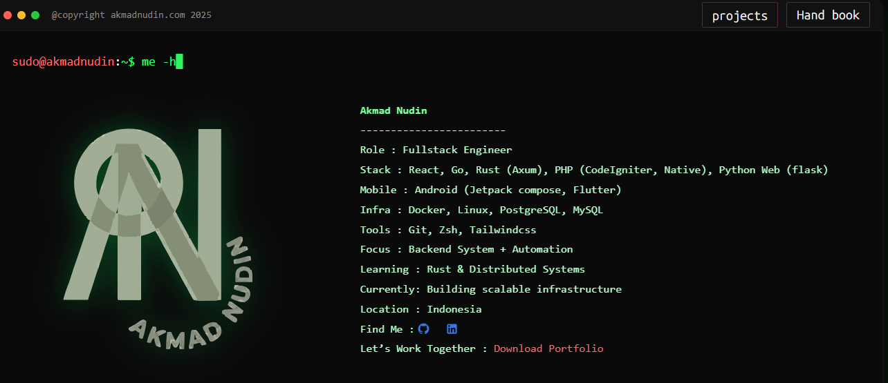

## Akmad Nudin

### A bit about me

Hey! I'm Akmad Nudin, a Fullstack Engineer from Indonesia focused on building scalable backend systems and automation tools. I enjoy working across the stack, from frontend interfaces to infrastructure and distributed systems.

I spend most of my time building web applications, backend services, and developer-focused tooling while continuously exploring efficient system architecture and performance-oriented development.

---

### What I'm building

I'm currently focused on backend engineering, infrastructure scalability, and automation workflows. Most of my recent work revolves around designing reliable systems, improving developer experience, and experimenting with distributed architectures.

I'm also actively deepening my knowledge of Rust and modern backend ecosystems.

---

### Tech Stack

#### Frontend
- React
- TailwindCSS

#### Backend
- Go
- Rust (Axum)
- PHP (CodeIgniter & Native PHP)
- Flask

#### Mobile
- Android (Jetpack Compose)
- Flutter

#### Infrastructure & Database
- Docker
- Linux
- PostgreSQL
- MySQL

#### Tools
- Git
- Zsh

---

### Current Focus

- Backend Systems
- Automation
- Scalable Infrastructure
- Distributed Systems
- Rust Ecosystem

---

### The vibe

relax, write some code, be a tea drinking canadian nerd, and enjoy life 🍵

